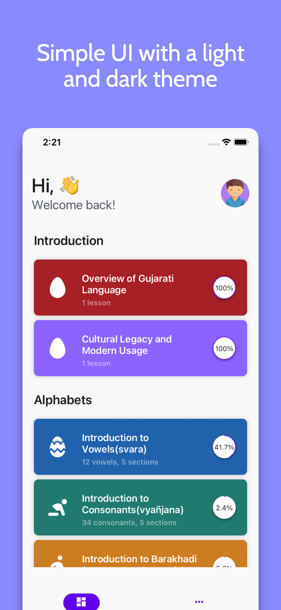
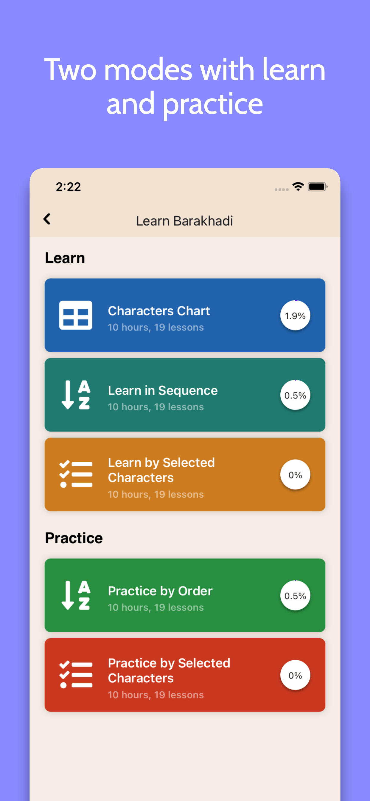
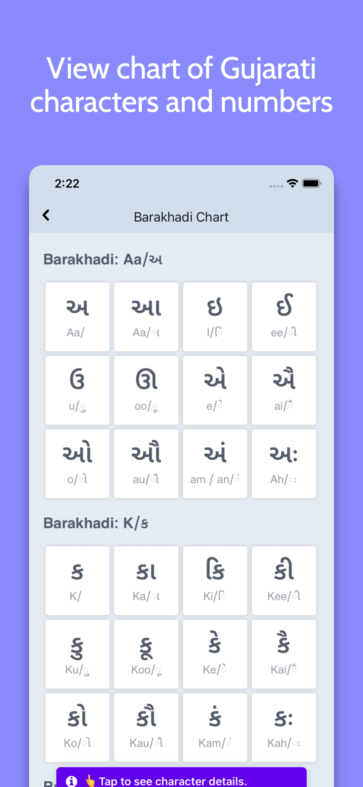
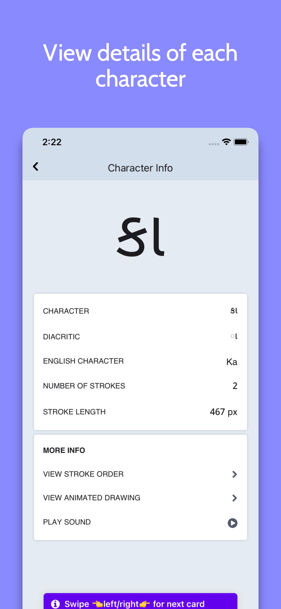
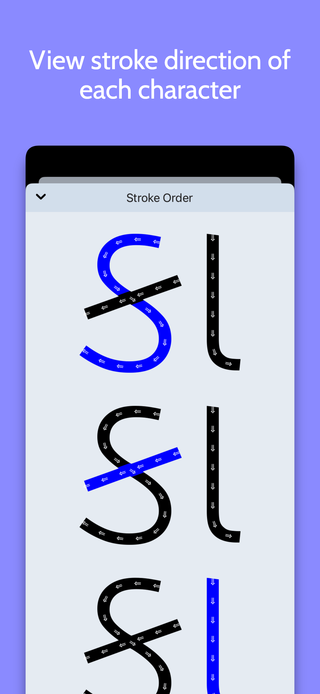
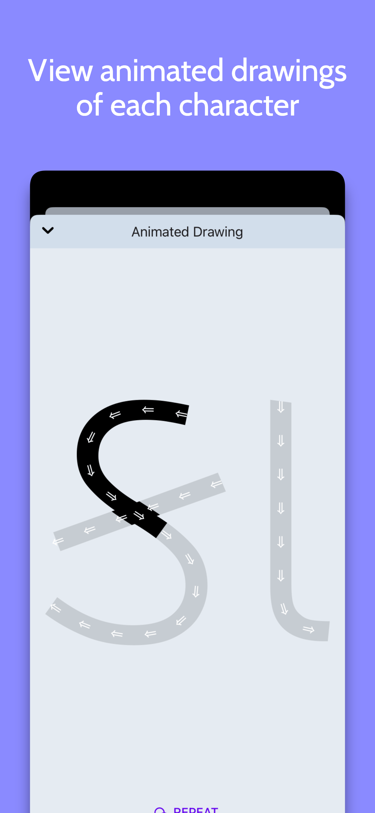
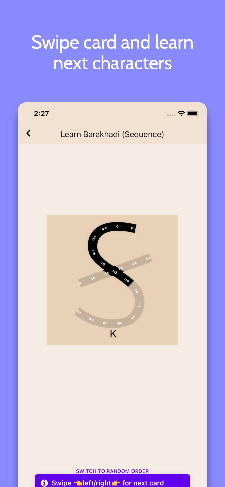
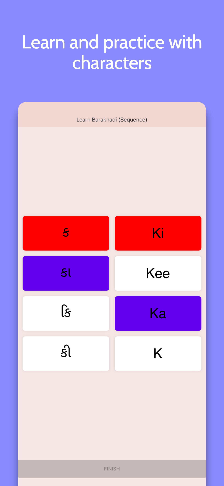

# Introduction

Learn Gujarati alphabets, numbers, and more...

## Installation

Get the app from Google Play:

### Screenshots

|                                            |                                                 |                                             |                                              |
|:------------------------------------------:|:-----------------------------------------------:|:-------------------------------------------:|:--------------------------------------------:|
|  |  |  |  |

|                                                        |                                                             |                                                              |                                                          |
|:------------------------------------------------------:|:-----------------------------------------------------------:|:------------------------------------------------------------:|:--------------------------------------------------------:|
|  |  |  |  |

The application supports Android 5.0 (API 21+) and above.

## Features include:

- Characters Chart
    - Explore characters, their details, and animations.
    - Easily navigate by swiping.
- Learn in Sequence
    - Sequentially learn alphabets and numbers.
    - Swipe through interactive cards with audio.
- Learn by Selected Characters
    - Customize learning by picking specific characters.
- Practice by Order
    - Test your knowledge matching characters.
    - Swipe through cards for practice.
- Practice by Selected Characters
    - Focus on specific characters.
    - Practice matching as in "Practice by Order."

## Additional Features

- Simple card UI and simple navigations.
- Dark theme support.
- Tablet, iPad and Landscape support.

## Building

>  Note: You can't Publish any Source code without permission.

### Basic setup

If you want to build from source, just do

    git clone https://github.com/gajjartejas/Kano.git
    cd Kano
    `npm install` or `yarn`
    cd ios && pod install && cd..

### With Android Studio

1. Clone repo `git clone https://github.com/gajjartejas/Kano.git`
2. In Android Studio select "Open an existing Android Studio Project"
3. Add `GoogleService-Info.json` file. (you need to create a firebase project then copy and paste it)
4. Wait for Gradel to sync and then run or build.

### With Xcode

1. Clone repo `git clone https://github.com/gajjartejas/Kano.git`
2. Navigate to `Kano/ios` and open `OpenHardwareMonClient.xcworkspace` folder.
3. Add `GoogleService-Info.plist` file. (you need to create a firebase project then copy and paste it)
4. Run the project.

## Contributing

There are many ways you can contribute to the development.

- Pull requests are always welcome!
- You must respect conventional commits for your commits and PR/MR title.
- You can merge only if your CI is green.
- give priority to squash and merge, and not merge with a merge commit
- Please visit [app.tolgee.io](https://app.tolgee.io/projects/501/translations) in order to update and create new translations

## License

Kano is licensed under the [GNU GENERAL PUBLIC LICENSE](https://github.com/gajjartejas/Kano/blob/main/LICENSE).
